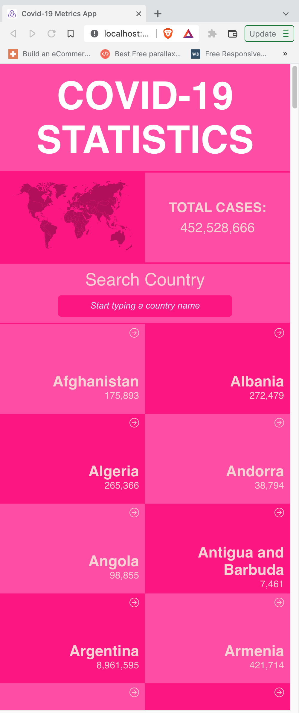
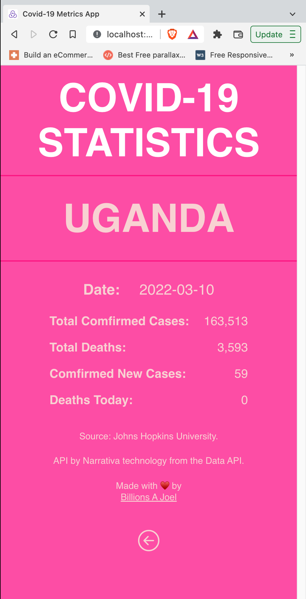

# COVID-19 STATISTICS App.

> Working with the real live data from the corona Nativa API. Building a mobile web application to check a list of metrics (numeric values) making use of React and Redux.
The app lists live data for covid 19 from ohns Hopkins University.

The API that provides numeric data about a topic that i like and then build the webapp around it.

# HOME PAGE

# SINGLE COUNTRY DETAILS

## Built Wit

- HTML, SCSS and Js (ES6).
- Using React Framework
- Webpack
- Git, Github and VsCode.
- Redux for state management
- Jest and react-testing-library

### Live Demo link

- Click [here](https://covid-metrics-app.herokuapp.com/) for live demo link.

### Video Demo

- Click [here](https://www.loom.com/share/f3a4a9bf8a03476abba66b2d9c8f8d68) for vide demo.

## Getting Started

To get a local copy up and running follow these simple example steps.

### Prerequisites

- A modern upto-date browser
- Text Editor or IDE

### Setup

1.  Clone the Repo or Download the Zip file or `https://github.com/billionsjoel/metrics-app.git`.
2.  `cd/metrics-app`

### Install

After cloning the project you need to run these commands

- `npm install` `This command will download all the dependancies of the project`
- `npm run start`

## Authors

👤 ** Atugonza Billions joel **

- GitHub: [@billionsjoel](https://github.com/billionsjoel)
- Twitter: [@billionsjoel](https://twitter.com/BillionsJoel)
- LinkedIn: [billionsjoel](https://www.linkedin.com/in/billionsjoel/)

## 🤝 Contributing

Contributions, issues, and feature requests are welcome!

Feel free to check the [issues page](https://github.com/billionsjoel/metrics-app/issues).

## Show your support

Give a ⭐️ if you like this project!

## Acknowledgments

- Hat tip to anyone whose code was used
- Inspiration
- etc

- Original design idea by [Nelson Sakwa on Behance](https://www.behance.net/gallery/31579789/Ballhead-App-%28Free-PSDs%29). Under the [Creative Commons License](https://creativecommons.org/licenses/by-nc/4.0/).

## 📝 License

This project is [MIT](./MIT.md) licensed.
